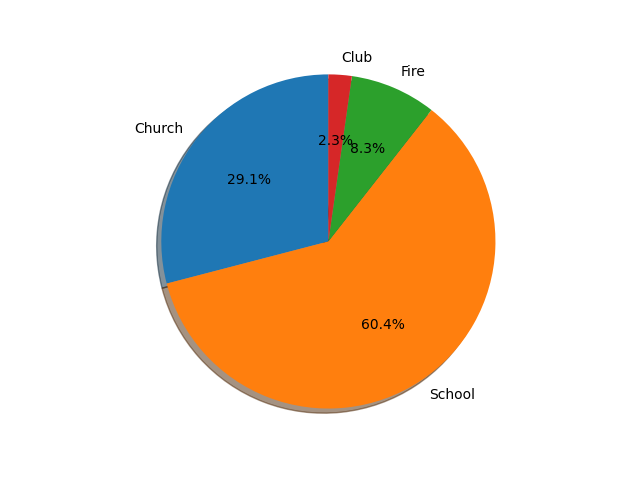
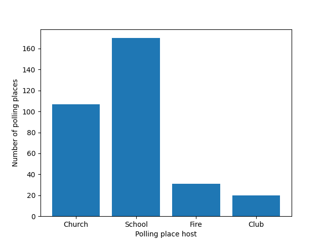

# Two visualizations of Los Angeles polling places
 
## 2015 LA Polling Places, categorized by host

_Data sourced from [data.gov](https://catalog.data.gov/dataset/election-2017-may-general-polling-place-list)._
According to this pie chart, 60.4% of LA polling places were located at schools, 29.1% were located at churches, 8.3% were located at fire stations, and 2.3% were located at clubs (such as Rotary Club chapters and neighborhood clubhouses). I can improve my analysis by factoring in other keywords. For instance, churches are often named "Christian Centers," while the "club" keyword does not account for Elks Lodges and other groups.

## 2017 LA Polling Places, categorized by host

_Data sourced from [data.gov](https://catalog.data.gov/dataset/election-2017-may-general-polling-place-list)._
According to this bar chart, Angelenos voted at over 100 churches, over 160 schools, around 40 fire stations, and around 20 clubs. I would love to create a line graph or some other plot comparing the 2015 and 2017 polling places. For example, did Los Angeles host more polling places at churches in 2017 than in 2015?

Hopefully, this follows [all the instructions outlined](https://github.com/mikeizbicki/cmc-csci040/tree/2021fall/hw_02) by Professor Mike Izbicki!
